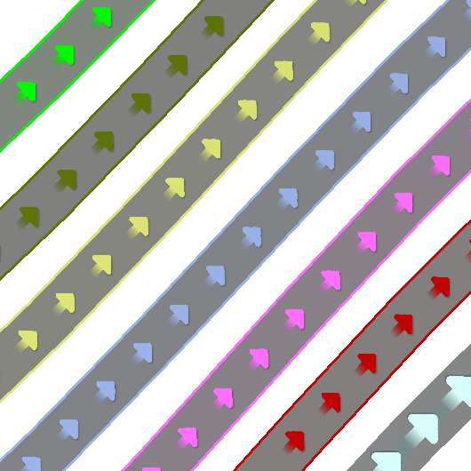
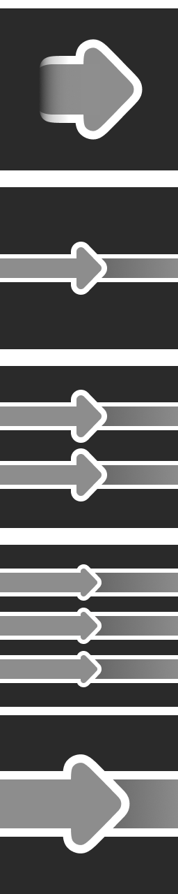

#  ProtoWireScroll

*Woof woof!* A [ResoniteModLoader](https://github.com/resonite-modding-group/ResoniteModLoader) mod for [Resonite](https://resonite.com/) that adds customizable animated textures to ProtoFlux wires! 🐾

| Example | Closeup | Texture |
|:-------------:|:-------------:|:-------------:|
|  |  |  |

## 🦴 Features

- Optimizes wire rendering with shared materials
- Adds customizable scrolling animations to wire textures
- Configurable animation speed and direction
- Customizable wire texture appearance options
- Fixes temporary wire connection issues

## 🐕 Installation

1. Install [ResoniteModLoader](https://github.com/resonite-modding-group/ResoniteModLoader) ([Wiki Installation Guide](https://github.com/resonite-modding-group/ResoniteModLoader/wiki/Installation))
2. Place `ProtoWireScroll.dll` into your `rml_mods` folder. This folder should be at `C:\Program Files (x86)\Steam\steamapps\common\Resonite\rml_mods` for a default install. You can create it if it's missing, or if you launch the game once with ResoniteModLoader installed it will create this folder for you.
3. Start the game. If you want to verify that the mod is working you can check your Resonite logs.

## 🎾 Configuration

The mod comes with several configurable options:

| Setting | Description |
|---------|-------------|
| Scroll Speed (X,Y) | Control the direction and speed of the animation |
| Scroll Repeat Interval | How often the animation repeats |
| Ping Pong Animation | Enable back-and-forth animation |
| Custom Wire Textures | Use your own textures for wires |
| Texture Filter Mode | Adjust texture rendering quality |

> **Note**: To switch a wire's appearance, it needs to be destroyed and re-created - simply reconnecting will reuse the old wire.

## 🐾 Notes

- Wire animations are local to users who have the mod installed
- Temporary wire connection fixes are included for inputs/outputs on the "wrong" side
- All settings can be adjusted on the fly through the RML config

---

*Happy wiring! Bark bark!* 🐕
