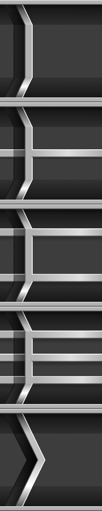
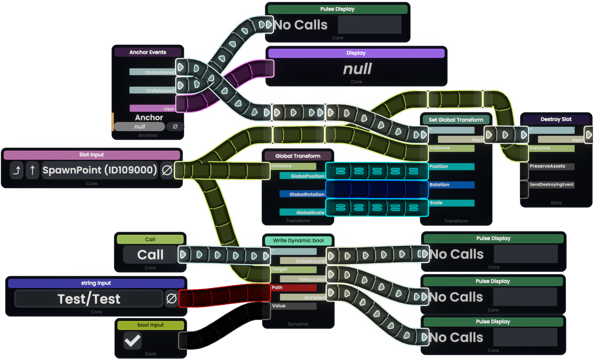

## *ProtoFluxOverhaul*

*Woof woof!* A [ResoniteModLoader](https://github.com/resonite-modding-group/ResoniteModLoader) mod for [Resonite](https://resonite.com/) that adds customizable animated textures to ProtoFlux wires! 🐾

| Node Closeup | Wire Closeup | Wire Texture |
|:-------------:|:-------------:|:-------------:|
|  |  |  

| Example |
|:-------------:|
|  | 

## 🦴 Features

- Overhauls the UI of ProtoFlux nodes
- Customizable, Connector, Wire, and Node Textures
- Comprehensive UI customization options
- Optimizes wire rendering with shared materials
- Configurable animation speed and direction

## 🐕 Installation

1. Install [ResoniteModLoader](https://github.com/resonite-modding-group/ResoniteModLoader) ([Wiki Installation Guide](https://github.com/resonite-modding-group/ResoniteModLoader/wiki/Installation))
2. Place `ProtoFluxOverhaul.dll` into your `rml_mods` folder. This folder should be at `C:\Program Files (x86)\Steam\steamapps\common\Resonite\rml_mods` for a default install. You can create it if it's missing, or if you launch the game once with ResoniteModLoader installed it will create this folder for you.
3. Start the game. If you want to verify that the mod is working you can check your Resonite logs.

## 🎾 Configuration

The mod comes with extensive configurable options organized into several categories:

### Basic Settings

| Setting | Default | Description |
|---------|---------|-------------|
| `Enabled` | `true` | Enable/disable the mod |
| `WireSounds` | `true` | Enable custom wire interaction sounds |
| `debugLogging` | `false` | Enable debug logging for troubleshooting |

### Animation Settings

| Setting | Default | Description |
|---------|---------|-------------|
| `scrollSpeed` | `[-0.5; 0]` | Control the direction and speed of wire animation (X,Y) |
| `scrollRepeat` | `[1; 1]` | How often the animation repeats (X,Y) |
| `pingPong` | `false` | Enable back-and-forth animation instead of looping |

### Texture URLs

| Setting | Description |
|---------|-------------|
| `farTexture` | Wire texture for distant viewing |
| `nearTexture` | Wire texture for close-up viewing |
| `roundedTexture` | Texture for rounded UI elements |
| `connectorInputTexture` | Texture for input connectors |
| `connectorOutputTexture` | Texture for output connectors |
| `callConnectorInputTexture` | Texture for call/impulse input connectors |
| `callConnectorOutputTexture` | Texture for call/impulse output connectors |
| `nodeBackgroundTexture` | Background texture for node bodies |
| `nodeBackgroundHeaderTexture` | Background texture for node headers |

### Audio Settings

| Setting | Default | Description |
|---------|---------|-------------|
| `grabSound` | `resdb:///391ce0c681b24b79a0240a1fa2e4a4c06492619897c0e6e045640e71a34b7ec7.wav` | Sound when grabbing a wire |
| `deleteSound` | `resdb:///b0c4195cce0990b27a3525623f46787d247c530387f8bc551e50bcf0584ab28b.wav` | Sound when deleting a wire |
| `connectSound` | `resdb:///8c63d74efcef070bf8fec2f9b1b20eecb15a499b17c64abaad225467d138d93b.wav` | Sound when connecting a wire |
| `audioVolume` | `1.0` | Volume level for wire sounds (0.0-1.0) |
| `minDistance` | `1.0` | Minimum distance for 3D audio falloff |
| `maxDistance` | `10.0` | Maximum distance for 3D audio falloff |

> **Note**: To switch a wire's appearance, it needs to be destroyed and re-created - simply reconnecting will reuse the old wire.

## ⚙️ Advanced Configuration

For users who want to fine-tune texture rendering, these advanced settings control how textures are loaded and displayed:

### Texture Quality & Filtering

| Setting | Default | Description |
|---------|---------|-------------|
| `filterMode` | `Anisotropic` | Texture filtering method (Point, Bilinear, Trilinear, Anisotropic) |
| `anisotropicLevel` | `8` | Level of anisotropic filtering (1-16) |
| `mipMaps` | `false` | Enable automatic mipmap generation |
| `keepOriginalMipMaps` | `false` | Preserve original texture mipmaps |
| `mipMapFilter` | `Box` | Filter method for mipmap generation |

### Texture Loading & Compression

| Setting | Default | Description |
|---------|---------|-------------|
| `uncompressed` | `false` | Load textures without compression |
| `directLoad` | `false` | Skip texture processing pipeline |
| `forceExactVariant` | `true` | Force exact texture variant matching |
| `crunchCompressed` | `true` | Use crunch compression for smaller file sizes |
| `preferredFormat` | `BC3_Crunched` | Preferred texture compression format |
| `preferredProfile` | `sRGB` | Color space profile for textures |

### Texture Wrapping & Memory

| Setting | Default | Description |
|---------|---------|-------------|
| `wrapModeU` | `Repeat` | Horizontal texture wrapping (Repeat, Clamp, Mirror) |
| `wrapModeV` | `Repeat` | Vertical texture wrapping (Repeat, Clamp, Mirror) |
| `readable` | `true` | Keep texture data accessible in memory |

## 🐾 Notes

- Wire/Nodes are only patched for the local user owned ProtoFlux.
- All settings can be adjusted on the fly through the RML/MonkeyLoader config
---

*Happy wiring! Bark bark!* 🐕
